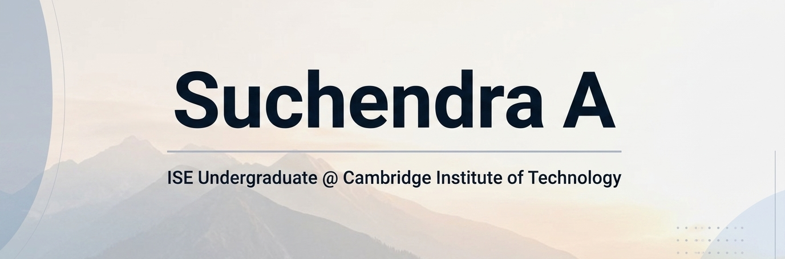

 

# Suchendra A

### Information Science Engineering

Cambridge Institute of Technology • Bengaluru, India

 

&nbsp;&nbsp;&nbsp;

&nbsp;&nbsp;&nbsp;

---

</table>

---

<h2 align="center">GitHub Dashboard</h2>

<table>

<tr>
<td>

</td>

<td>

</td>

</tr>

<tr>

<td  align="center" >

</td>
<td  align="center">

</td>

 

</tr>

</table>

---

<h2 align="center">Technology Stack</h2>

<table>

<tr>

<td align="center">

### Languages

</td>

<td align="center">

### Frontend

</td>

<td align="center">

### Backend

</td>

</tr>

<tr>

<td align="center">

### Database

</td>

<td align="center">

### AI / ML

 

TensorFlow • Keras • CNN

</td>

<td align="center">

### Tools

</td>

</tr>

</table>

---
# Live Applications

<table>

<tr>

<td width="33%" align="center">

### 📋 Task Manager

Modern task management platform built using the MERN Stack featuring authentication, dashboards and responsive UI.

 

</td>

<td width="33%" align="center">

### 🏎️ F1 MapFeed

Formula One telemetry visualization platform powered by FastF1 and Flask.

 

</td>

<td width="33%" align="center">

### 🤖 Digit Recognition

CNN powered handwritten digit recognition application built using TensorFlow.

 

</td>

</tr>

</table>

---
<h2 align="center">GitHub Activity</h2>

  

---

#<h2 align="center">Let's Connect</h2>

&nbsp;&nbsp;&nbsp;

&nbsp;&nbsp;&nbsp;

 

<b>Feel free to connect for collaboration, open-source contributions, internships, or software development discussions.<b>

---